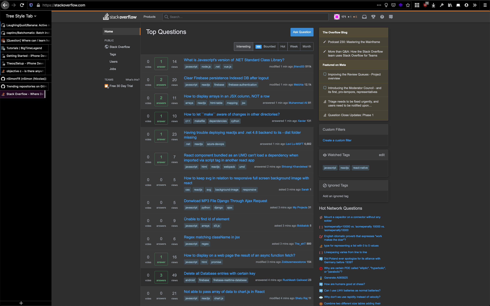

# My firefox configuration

### Features:

- Minimal dark theme
- No titlebar
- Auto-expanding tabs in sidebar with tree support
- Perfect for tab groups and containers

## Expanded

## Minimal

# Essential extensions list:

- [Tab Groups](https://github.com/Drive4ik/simple-tab-groups)
- [Tree Style Tab](https://github.com/piroor/treestyletab/)
- Any dark theme (Here is mine: [Complete Black Theme for Firefox](https://addons.mozilla.org/en-US/firefox/addon/complete-black-theme-for-firef/))
